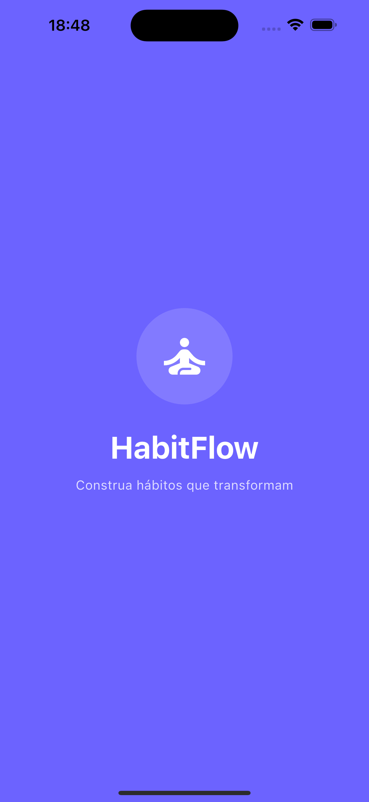
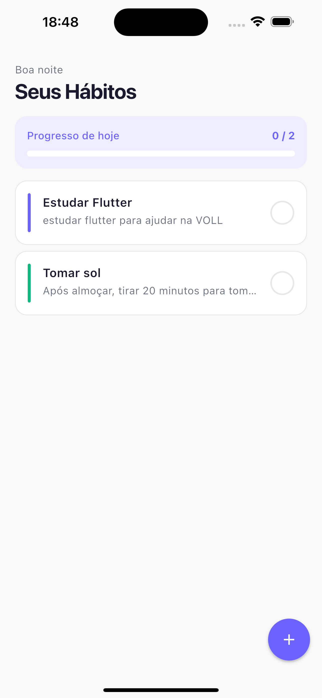
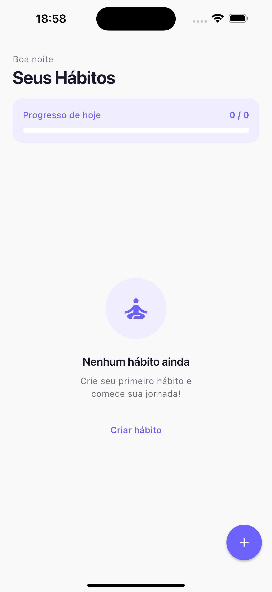
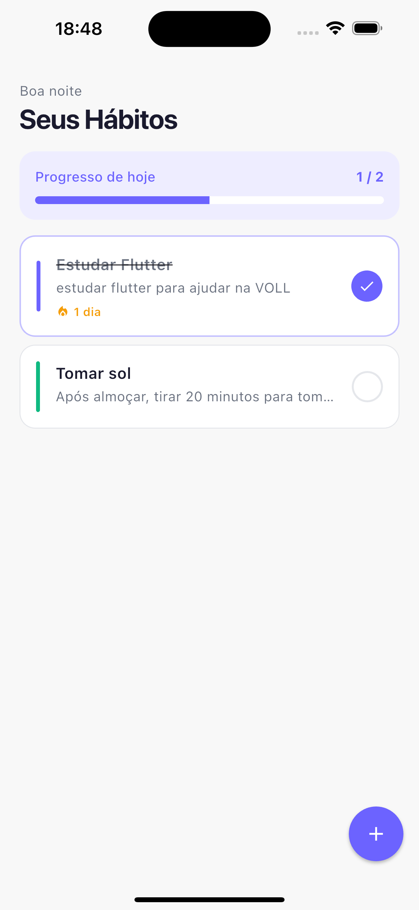
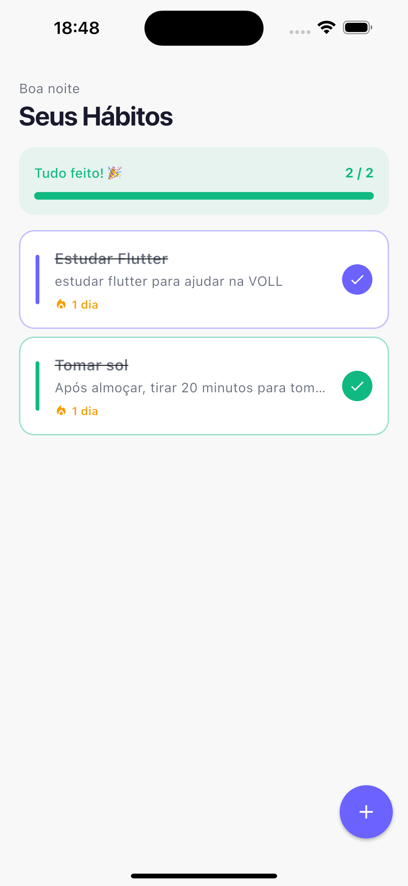
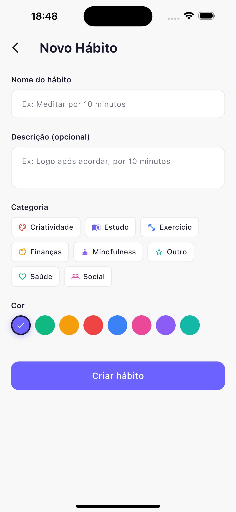
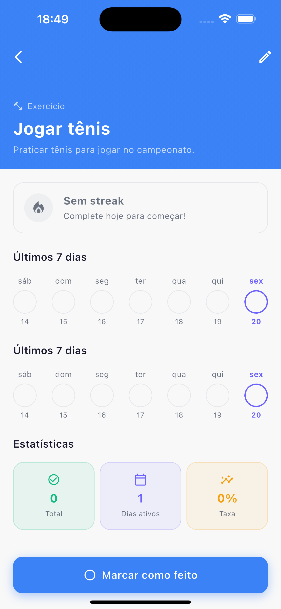
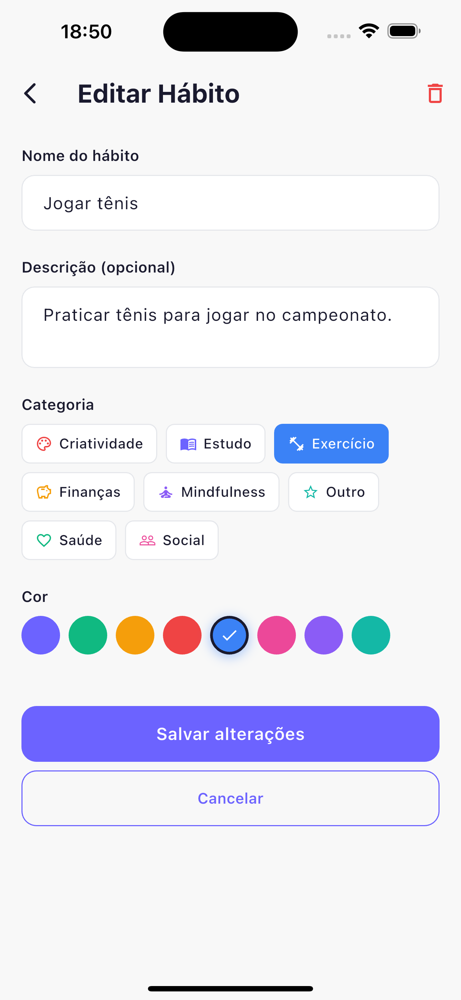

# HabitFlow 🌱

> Construa hábitos que transformam


---

## 📱 Sobre o projeto

O **HabitFlow** é um app de rastreamento de hábitos desenvolvido com foco em boas práticas de engenharia de software. O objetivo do projeto é demonstrar o uso de **Clean Architecture**, **BLoC pattern** e **persistência local com SQLite** em um app Flutter completo e funcional.

---

## 🖼️ Screenshots

<table>
  <tr>
    <td align="center"><b>Splash</b></td>
    <td align="center"><b>Home</b></td>
    <td align="center"><b>Home vazia</b></td>
    <td align="center"><b>Progresso parcial</b></td>
    <td align="center"><b>Tudo concluído</b></td>
  </tr>
  <tr>
    <td></td>
    <td></td>
    <td></td>
    <td></td>
    <td></td>
  </tr>
  <tr>
    <td align="center"><b>Criar hábito</b></td>
    <td align="center"><b>Detalhes e streak</b></td>
    <td align="center"><b>Editar hábito</b></td>
  </tr>
  <tr>
    <td></td>
    <td></td>
    <td></td>
  </tr>
</table>

---

## ✨ Funcionalidades

- ✅ Criar, editar e excluir hábitos
- 🔥 Streak de dias consecutivos por hábito
- 📊 Gráfico de progresso semanal
- 🗂️ Categorias pré-definidas com ícones e cores
- 📅 Grade visual dos últimos 7 dias
- 📈 Estatísticas de taxa de conclusão
- 💾 Persistência local com SQLite
- 🎨 Visual minimalista e clean

---

## 🏗️ Arquitetura

O projeto segue os princípios da **Clean Architecture**, dividida em 3 camadas principais:

```
lib/
├── core/
│   ├── database/         # DatabaseHelper (SQLite)
│   ├── di/               # Injeção de dependência (GetIt)
│   ├── errors/           # Failures
│   ├── theme/            # AppTheme, AppColors, AppSpacing
│   ├── usecases/         # Contrato base UseCase
│   └── widgets/          # Widgets reutilizáveis
│
├── features/
│   ├── habits/
│   │   ├── data/
│   │   │   ├── datasources/    # HabitLocalDatasource
│   │   │   ├── models/         # HabitModel, HabitCompletionModel
│   │   │   └── repositories/   # HabitRepositoryImpl
│   │   ├── domain/
│   │   │   ├── entities/       # Habit, HabitCompletion, HabitWithStats
│   │   │   ├── repositories/   # HabitRepository (contrato)
│   │   │   ├── usecases/       # GetHabitsWithStats, CreateHabit, etc.
│   │   │   └── utils/          # StreakCalculator
│   │   └── presentation/
│   │       ├── bloc/           # HabitBloc, HabitEvent, HabitState
│   │       ├── pages/          # HomePage, CreateHabitPage, HabitDetailPage
│   │       └── widgets/        # HabitCard, WeeklyChartWidget, etc.
│   │
│   └── categories/
│       ├── data/
│       ├── domain/
│       └── presentation/
│           └── cubit/          # CategoryCubit, CategoryState
│
└── main.dart
```

### Fluxo de dados

```
UI → BLoC/Cubit → UseCase → Repository (contrato) → RepositoryImpl → Datasource → SQLite
```

---

## 🛠️ Stack Técnica

| Camada                 | Tecnologia                                            | Motivo                                         |
| ---------------------- | ----------------------------------------------------- | ---------------------------------------------- |
| State Management       | [flutter_bloc](https://pub.dev/packages/flutter_bloc) | Separação clara entre UI e lógica de negócio   |
| Injeção de Dependência | [get_it](https://pub.dev/packages/get_it)             | Service locator simples e eficiente            |
| Banco de Dados         | [sqflite](https://pub.dev/packages/sqflite)           | Persistência local sem necessidade de backend  |
| Error Handling         | [dartz](https://pub.dev/packages/dartz)               | Either type para tratamento funcional de erros |
| Gráficos               | [fl_chart](https://pub.dev/packages/fl_chart)         | Visualização do progresso semanal              |
| Modelos                | [equatable](https://pub.dev/packages/equatable)       | Comparação de objetos por valor                |
| IDs únicos             | [uuid](https://pub.dev/packages/uuid)                 | Geração de identificadores únicos              |

---

## 🧠 Decisões Técnicas

### Por que Clean Architecture?

A separação em Domain, Data e Presentation garante que a **regra de negócio seja independente** de frameworks, banco de dados e UI. Isso facilita testes unitários, manutenção e escalabilidade — se amanhã for necessario trocar SQLite por Firebase, apenas a camada de Data é alterada.

### Por que BLoC para hábitos e Cubit para categorias?

O **BLoC** foi escolhido para os hábitos por ser uma feature com múltiplos eventos (criar, editar, deletar, toggle). O **Cubit** foi usado para categorias por ser uma feature mais simples, com menos estados e transições — o Cubit reduz o boilerplate quando a complexidade não justifica o BLoC completo.

### Por que Dartz (Either)?

O uso do tipo `Either<Failure, Success>` força o tratamento explícito de erros em todas as camadas, eliminando exceções não tratadas. A UI sempre sabe se recebeu um sucesso ou uma falha, sem depender de try/catch espalhados pelo código.

### Por que SQLite em vez de Firebase?

O app é **offline-first por design**. Os dados do usuário ficam no dispositivo, sem dependência de internet ou backend. Isso garante privacidade, performance e funcionamento sem conectividade.

### Cálculo de Streak

A lógica de streak foi isolada na classe `StreakCalculator` dentro da camada de Domain, sem nenhuma dependência externa. Isso a torna facilmente testável com testes unitários puros em Dart.

---

## 🚀 Como rodar o projeto

### Pré-requisitos

- Flutter SDK `>=3.0.0`
- Dart SDK `>=3.0.0`

### Instalação

```bash
# Clone o repositório
git clone https://github.com/seu-usuario/habit_flow.git

# Acesse a pasta
cd habit_flow

# Instale as dependências
flutter pub get

# Rode o app
flutter run
```

---

## 📂 Organização dos Use Cases

| Use Case                | Descrição                                         |
| ----------------------- | ------------------------------------------------- |
| `GetHabitsWithStats`    | Busca todos os hábitos com streak e status do dia |
| `CreateHabit`           | Cria um novo hábito                               |
| `UpdateHabit`           | Atualiza um hábito existente                      |
| `DeleteHabit`           | Remove um hábito e suas conclusões                |
| `ToggleCompletion`      | Marca ou desmarca o hábito como concluído hoje    |
| `GetCompletionsForWeek` | Busca conclusões dos últimos 7 dias               |
| `GetCategories`         | Lista todas as categorias                         |
| `SeedDefaultCategories` | Popula as categorias padrão na primeira execução  |

---

## 🤝 Contribuindo

Contribuições são bem-vindas! Sinta-se à vontade para abrir issues ou pull requests.

---

## 📄 Licença

Distribuído sob a licença MIT. Veja `LICENSE` para mais informações.

---

<p align="center">Feito com 💜 e Flutter</p>
